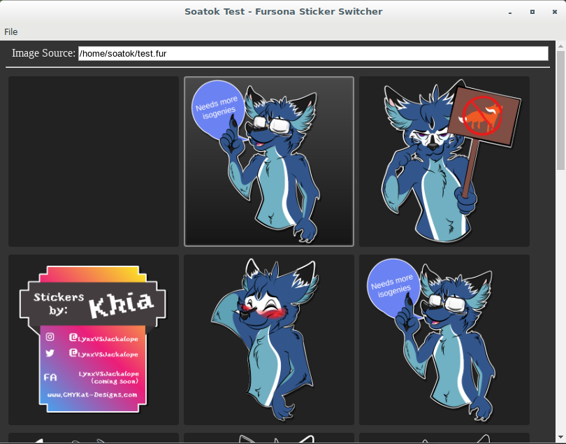

# Fursona Sticker Switcher

Small GUI application that swaps out images on the fly. 

Meant to be used with character stills or a personal Telegram sticker pack.

## Install Instructions

### Streamers

Go to the [Releases](https://github.com/soatok/twitch-fursona-stickers/releases)
page and download the latest release for your operating system.

Once you have the appropriate archive downloaded, extract it. 

### Developers

First, clone our repository using git. Then, run `npm install --save`.

## Using this App

### Windows

Extract the ZIP folder to a directory somewhere on your computer.

Run `electron.exe`.

For better performance, right click and select **Run as Administrator.**

### Linux

Extract the ZIP folder to a directory somewhere on your computer.

Run the `electron` binary.

### Mac OS X

Extract the ZIP folder to a directory somewhere on your computer.

Run `Electron.app`.

### Once The App is Running

At the top of your screen, you will see a textbox labelled "Image Source".
Copy and paste this into the file path for an Image Source in your streaming 
software.
 
You may edit this field if you have a specific file destination in mind.

Now go to File > Add Image to add your stickers. You may also drag and drop
images from Windows Explorer.

Once you click on the sticker, it should update in your streaming software.

To remove a sticker, right click and select "Remove Sticker".

To rearrange stickers, simply drag and drop them withing the application
window.

#### Telegram Sticker Pack Import

From your Telegram app, click the "Share" button for your desired
sticker pack. This will copy the URL to your clipboard.

In our app, go to File > Import > Telegram.

You may also change the destination directory that stickers will be
saved to from this window.

Paste the URL in the Sticker URL field in the window. Press Import.

## Caveats with Animated GIFs and Streamlabs OBS

If you append `.gif` to the Image Source file path, you can use GIFs (but
only GIFs) and they will animate. If you leave the image source without an
extension, it works with all image types, but GIFs will not be animated.

In the future, I'll devise a workaround (even if it means sending a pull
request to Streamlabs OBS) to make this usability wart go away.
